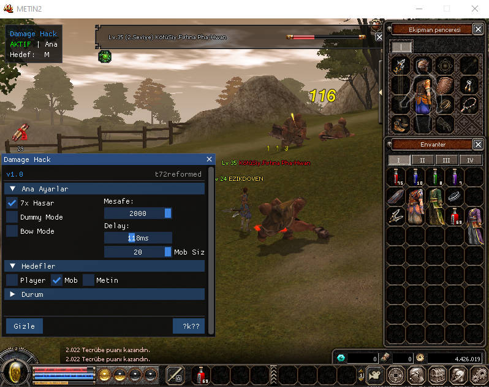

# 🎯 D3D8 Internal Hook (Metin2)

Bu proje, **Direct3D 8** tabanlı oyunlar için geliştirilmiş, **ImGui** arayüzüne sahip bir internal render & memory manipulation sistemidir.

📌 Proje tamamen **eğitim ve araştırma amaçlıdır**. Ticari amaçla kullanılması veya resmi oyun sunucularında çalıştırılması **kesinlikle önerilmez**.

> ⚠️ **Offsetler** güvenlik ve etik nedenlerle bilerek dahil edilmemiştir. Kullanmak isteyen kişilerin kendi istemcilerine uygun offsetleri **manuel** olarak tanımlamaları gerekir.

---


## ✨ Özellikler

- ✅ 1000x Exploit Damage
- ✅ 7x Damage
- ✅ Attack Delay ile Vuruş Hızı Değiştirme
- ✅ Detaylı Entity Scan & Bitmask Filtreleme
- ✅ Shared Memory ile Dummy Communication
- ✅ DirectX 8 Overlay Render
- ✅ ImGui Tabanlı Menü Arayüzü
- ✅ Çoklu Hedef Seçimi (Multi-target Support)
- ✅ Yay (Bow) Exploiti
- ✅ Dinamik ve Özelleştirilebilir Ayarlar

---

## 🧠 Gereksinimler

- ✅ Visual Studio 2019 veya üzeri
- ✅ Windows SDK
- ✅ C++17 veya daha yeni bir standart
- ✅ D3D8 SDK
- ✅ DLL Inject edebilme yetkinliği

---

```md
